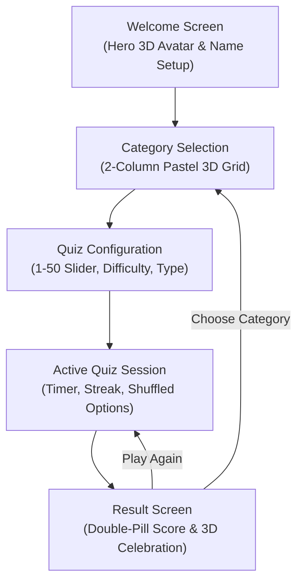

# 🎯 Quizzical — Modern 3D Trivia Quiz Mobile Application

<div align="center">
  
  <br />
  <br />

  [](https://flutter.dev)
  [](https://dart.dev)
  [](#-platforms-supported)
  [](#-architecture--state-management)
  [](https://opentdb.com)
  [](LICENSE)
  [-brightgreen)](#-testing--quality-assurance)

  <p align="center">
    <strong>A production-ready Flutter mobile application featuring a premium 3D Claymorphism design system, Open Trivia Database API integration, responsive zero-overflow layouts, and reactive quiz state management.</strong>
  </p>
</div>

---

## 📖 Overview

**Quizzical** is a trivia quiz application built with Flutter and Dart. It combines educational gameplay with a modern **3D Claymorphism** visual language, soft pastel color palettes, and fluid animations.

Powered by the **Open Trivia Database (OpenTDB) REST API**, the application dynamically supports 24+ trivia categories, customizable question counts (1–50), multiple difficulty levels, multiple-choice & true/false formats, real-time countdown timers, interactive answer verification, streak tracking, and local high-score persistence.

---

## ✨ Key Features

### 🎨 1. Premium 3D Claymorphism Design System
- **Unified 3D Aesthetic**: Custom 3D claymorphic character illustrations, app icons, and category graphics designed with soft rounded curves, subtle shadows, and toy-like finishes.
- **Dynamic 21+ Category Asset Mapping**: Intelligent registry ([`CategoryHelper`](lib/utils/category_helper.dart)) mapping each OpenTDB category to individual 3D illustrations, dedicated pastel backgrounds, and accent colors.
- **Graceful Fallback Mechanism**: Dynamic categories without dedicated artwork automatically render custom fallback illustrations and themed badges without crashing.

### 📐 2. Responsive & Zero-Overflow Layout
- **No RenderFlex Bottom Overflows**: Uses `LayoutBuilder`, `SingleChildScrollView`, `ConstrainedBox`, and dynamic illustration height clamping (`clamp(180, 270)`) across all phone screen sizes.
- **Consistent Grid Ratios**: Category selection displays in a 2-column grid with a dedicated `0.84` aspect ratio, ensuring full visibility of text labels and 3D graphics on any device.

### ⚡ 3. Real-Time Quiz Engine & State Management
- **Reactive Provider Architecture**: Centralized [`QuizProvider`](lib/providers/quiz_provider.dart) handles state for category fetching, quiz configuration, question delivery, answer shuffling, timer ticks, scoring, and history.
- **Per-Question Countdown Timer**: Visual countdown timer with warning color shifts as time runs low.
- **Streak & Performance Counter**: Tracks consecutive correct answers (🔥 streak) and computes real-time accuracy percentages.
- **HTML Entity Decoding**: Custom robust decoder for special characters, named HTML entities (`&quot;`, `&#039;`, `&amp;`, `&eacute;`, etc.) from trivia questions and answers.

### 📱 4. Polished UX & Micro-interactions
- **Skeleton Shimmer Loading**: Clean 2-column skeleton placeholder cards displayed while fetching dynamic categories from the API.
- **Interactive Exit & Error Handlers**: Confirm dialogs for mid-quiz exit and friendly offline/network retry cards.
- **Double-Pill Score Badges**: Custom double-pill result containers (`#DCFCE7` outer halo with `#74DBA2` inner pill) displaying dynamic high-score celebration vs. encouragement feedback.
- **Replay & Review Navigation**: Seamless one-tap restart with identical or new category parameters.

---

## 📱 Application Flow & Screens



### 🖼️ Screen Breakdown:
1. **Welcome Screen (`HomeScreen`)**:
   - Centered 3D character quiz avatar with yellow 3D question mark backdrop.
   - Interactive player name customization dialog (`Your_Name`).
   - Deep teal primary CTA button (`GET STARTED`).
2. **Category Selection (`CategoriesScreen`)**:
   - Quizzical brand logo and header.
   - 2-column responsive grid of rounded pastel cards for General Knowledge, Science, History, Books, Art, Vehicles, Film, Music, Games, and more.
3. **Configuration Screen (`QuizConfigScreen`)**:
   - 3D gear and control panel illustration.
   - Question count slider (1–50) with live value badge.
   - Difficulty dropdown (Any, Easy, Medium, Hard).
   - Question type selector (Multiple Choice / True-False).
4. **Quiz Screen (`QuizScreen`)**:
   - Question counter (`01/10`), progress bar, live countdown timer chip, and streak tracker.
   - Question card with soft shadow and high-contrast typography.
   - Answer cards with letter indicators (A, B, C, D) and immediate visual feedback (green checkmark for correct, coral red cross for incorrect).
5. **Result Screen (`ResultScreen`)**:
   - Dynamic score percentage calculation.
   - **High Score ($\ge 50\%$)**: 3D Party popper celebration illustration and mint green double-pill score box.
   - **Low Score ($< 50\%$)**: 3D Encouragement visual with motivational feedback.
   - Replay quiz and Category re-selection buttons.

---

## 📂 Project Structure

```
quizzical/
├── assets/
│   ├── branding/              # Brand logos, app icon marks
│   │   ├── quizzical_logo.png
│   │   ├── quizzical_icon.png
│   │   └── quizzical_logo_mark.png
│   ├── categories/            # 21+ individual 3D category assets
│   │   ├── general_knowledge.png
│   │   ├── books.png
│   │   ├── history.png
│   │   ├── science_nature.png
│   │   ├── art.png
│   │   ├── vehicles.png
│   │   ├── film.png
│   │   ├── music.png
│   │   ├── video_games.png
│   │   ├── computers.png
│   │   ├── sports.png
│   │   ├── geography.png
│   │   └── default_quiz.png
│   ├── quiz/                  # Welcome hero and configuration 3D art
│   │   ├── welcome_hero.png
│   │   └── configuration.png
│   └── result/                # Celebration and encouragement 3D illustrations
│       ├── celebration.png
│       └── keep_trying.png
├── lib/
│   ├── main.dart              # Application entry point & Provider setup
│   ├── models/                # Data structures (Category, Question, CategoryVisual)
│   │   ├── category.dart
│   │   └── question.dart
│   ├── providers/             # State management
│   │   └── quiz_provider.dart
│   ├── screens/               # Screen widgets
│   │   ├── home_screen.dart
│   │   ├── categories_screen.dart
│   │   ├── quiz_config_screen.dart
│   │   ├── quiz_screen.dart
│   │   └── result_screen.dart
│   ├── services/              # Networking layer
│   │   └── trivia_service.dart
│   ├── utils/                 # Design tokens, HTML decoder & helpers
│   │   ├── app_colors.dart
│   │   ├── category_helper.dart
│   │   └── html_decoder.dart
│   └── widgets/               # Reusable atomic UI components
│       ├── answer_option.dart
│       ├── category_card.dart
│       ├── category_illustrations.dart
│       ├── illustrations.dart
│       └── primary_button.dart
├── test/
│   ├── quiz_test.dart         # Unit tests for models, decoder, and provider
│   └── widget_test.dart       # Widget UI smoke tests
├── pubspec.yaml               # Dependencies and asset declarations
└── README.md
```

---

## 🌐 API Reference

The app communicates with the **Open Trivia Database (OpenTDB)** REST API:

- **Categories Endpoint**:
  ```http
  GET https://opentdb.com/api_category.php
  ```
- **Questions Endpoint**:
  ```http
  GET https://opentdb.com/api.php?amount={amount}&category={id}&difficulty={difficulty}&type={type}
  ```

---

## 🧪 Testing & Quality Assurance

The codebase includes comprehensive unit tests and widget tests covering HTML decoding, JSON model serialization, provider logic, and UI rendering:

```bash
flutter test
```

### Test Suite Summary:
- ✔️ Named HTML entity decoding (`&quot;`, `&amp;`, `&#039;`, etc.)
- ✔️ Numeric decimal and hex HTML entity parsing
- ✔️ `Category.fromJson` serialization
- ✔️ `Question.fromJson` answer combination and shuffling
- ✔️ `QuizProvider` configuration defaults and lifecycle
- ✔️ `QuizzicalApp` widget tree smoke test

Code analysis:
```bash
flutter analyze
# Result: No issues found!
```

---

## 🚀 Getting Started

### Prerequisites
- [Flutter SDK](https://docs.flutter.dev/get-started/install) (`^3.13.0` or higher)
- [Dart SDK](https://dart.dev/get-dart) (`^3.0.0`)
- Android Studio / VS Code with Flutter extension
- Android SDK (API 34+ recommended)

### Installation
1. **Clone the repository**:
   ```bash
   git clone https://github.com/SOURAVcse9/quizzical-flutter-app.git
   cd quizzical-flutter-app
   ```

2. **Install Flutter packages**:
   ```bash
   flutter pub get
   ```

3. **Run the app**:
   ```bash
   flutter run
   ```

4. **Build Release APK**:
   ```bash
   flutter build apk --release
   ```
   *The generated APK will be available at `build/app/outputs/flutter-apk/app-release.apk`.*

---

## 👨‍💻 Author

**Sourav Debnath**
- **GitHub**: [@SOURAVcse9](https://github.com/SOURAVcse9)
- **Email**: [sourav.cse9.bu@gmail.com](mailto:sourav.cse9.bu@gmail.com)
- **Institution**: Department of Computer Science & Engineering, University of Barishal

---

## 📄 License

This project is licensed under the [MIT License](LICENSE).
