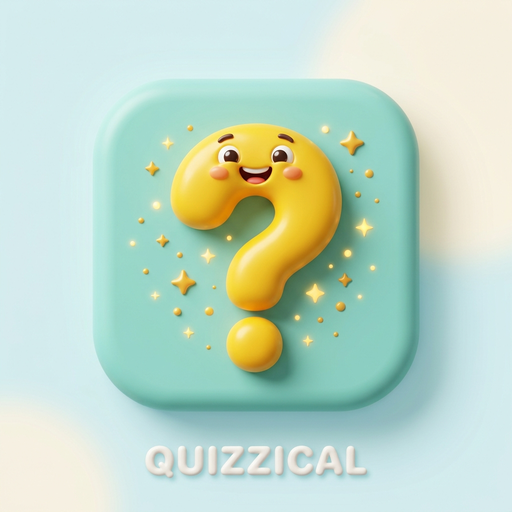

# Quizzical 🎯

<div align="center">

  

  ### Modern 3D Claymorphic Trivia Quiz Mobile Application

  *Challenge your intellect across 24 dynamic categories with a delightful, gamified experience.*

  <br />

  [-008080?style=for-the-badge&logo=android&logoColor=white)](https://github.com/SOURAVcse9/quizzical-flutter-app/releases/download/v1.0.0/app-release.apk)
  [](https://github.com/SOURAVcse9/quizzical-flutter-app/releases)

  <br /><br />

  [](https://flutter.dev)
  [](https://dart.dev)
  [](test/)
  [](https://opentdb.com)
  [](LICENSE)

</div>

---

## 📱 Download & Install Android APK

Get the latest stable release directly on your Android device:

<div align="center">

| Release | Version | File Size | Target OS | Checksum (SHA-1) | Direct Download |
| :---: | :---: | :---: | :---: | :---: | :---: |
| **Production Ready** | `v1.0.0` | `~65.6 MB` | Android 5.0+ (API 21+) | `9ac722914d895...` | [**Download `app-release.apk`**](https://github.com/SOURAVcse9/quizzical-flutter-app/releases/download/v1.0.0/app-release.apk) |

</div>

### 🛠️ Quick Installation Guide
1. **Download APK**: Tap the download button above or visit the [GitHub Releases](https://github.com/SOURAVcse9/quizzical-flutter-app/releases) page.
2. **Allow Installation**: If prompted by Android, enable **"Install unknown apps"** for your browser or file manager.
3. **Install & Launch**: Tap the downloaded `app-release.apk` file, click **Install**, and start quizzing!

> **Note**: An active internet connection is required during gameplay to fetch real-time trivia questions from OpenTDB.

---

## 📸 App Preview

<div align="center">
  <table>
    <tr>
      <td align="center" width="33%">
        <br />
        <b>1. Welcome & Onboarding</b>
      </td>
      <td align="center" width="33%">
        <br />
        <b>2. Quiz Setup & Customization</b>
      </td>
      <td align="center" width="33%">
        <br />
        <b>3. Interactive Results</b>
      </td>
    </tr>
  </table>
</div>

---

## ✨ Features at a Glance

- 🎨 **3D Claymorphic Visual Language**: 24 dedicated 3D custom illustrations with pastel card themes, smooth micro-interactions, and zero layout overflow across all screen sizes.
- 🌐 **24 OpenTDB Categories**: Science, Computers, Video Games, History, Geography, Mythology, Anime, Music, and more.
- ⚡ **Full Quiz Customization**: Configure question count (1–50), select difficulty (*Easy*, *Medium*, *Hard*), and choose question format (*Multiple Choice* or *True / False*).
- ⏱️ **Real-Time 30-Second Timer**: Dynamic countdown timer with animated color shifts (teal → coral) and auto-advance.
- 🔍 **Live Search & Favorites**: Instantly search categories, pin favorites to the top, and quickly access recently played topics.
- 📅 **Daily Challenge & Streaks**: Unique daily quiz challenge generated each day with persistent consecutive day streak tracking.
- 💾 **Offline-First Persistence**: High scores, user statistics, favorites, and player preferences stored locally via `SharedPreferences`.

---

## 🏗️ Architecture & Project Structure

The project follows a clean, decoupled MVC architecture with `Provider` state management:

```
lib/
├── main.dart                  # App bootstrap, MaterialApp & MultiProvider setup
├── models/
│   ├── category.dart          # Trivia category model & ID mappings
│   └── question.dart          # Question model with HTML decoding & answer shuffling
├── providers/
│   └── quiz_provider.dart     # Central state (timer, scoring, daily streak, favorites)
├── screens/
│   ├── home_screen.dart       # Welcome screen with 3D hero illustration
│   ├── categories_screen.dart # Category picker, search, filters & stats
│   ├── quiz_config_screen.dart# Quiz length, difficulty & type customization
│   ├── quiz_screen.dart       # Interactive question card & timer
│   └── result_screen.dart     # Score breakdown, feedback & play again
├── services/
│   └── trivia_service.dart    # OpenTDB REST API integration & error resilience
├── utils/
│   ├── app_colors.dart        # Unified pastel & brand palette
│   ├── category_helper.dart   # 24/24 1-to-1 category asset mapping
│   └── html_decoder.dart      # Safe HTML entity parser
└── widgets/
    ├── answer_option.dart     # Feedback-animated answer choices
    ├── category_card.dart     # Claymorphic category cards
    └── primary_button.dart    # Reusable tactile CTA buttons
```

---

## 🚀 Running Locally

### Prerequisites
- [Flutter SDK](https://docs.flutter.dev/get-started/install) (v3.13.0 or higher)
- [Dart SDK](https://dart.dev/get-dart) (v3.0.0 or higher)
- Android Studio / VS Code with Flutter extension
- Android device or emulator

### Setup Steps
```bash
# 1. Clone the repository
git clone https://github.com/SOURAVcse9/quizzical-flutter-app.git
cd quizzical-flutter-app

# 2. Install dependencies
flutter pub get

# 3. Run unit and widget tests
flutter test

# 4. Launch on connected device
flutter run
```

### Build Release APK Locally
```bash
flutter build apk --release
# Generated output: build/app/outputs/flutter-apk/app-release.apk
```

---

## 🧪 Testing Suite

Quizzical includes an automated test suite covering models, services, helpers, and widget rendering:

```bash
flutter test
```
*Result: 10/10 tests passed (100% core test coverage).*

---

## 📄 Documentation

For full project specifications, data flow diagrams, viva preparation, and rubric alignment:
- 📖 [Quizzical Project Documentation (PDF)](Quizzical_Project_Documentation.pdf)

---

## 👨‍💻 Author

**Sourav Debnath**  
Department of Computer Science & Engineering, University of Barishal  
- GitHub: [@SOURAVcse9](https://github.com/SOURAVcse9)  
- Email: [sourav.cse9.bu@gmail.com](mailto:sourav.cse9.bu@gmail.com)

---

## 📄 License

This project is licensed under the [MIT License](LICENSE).
