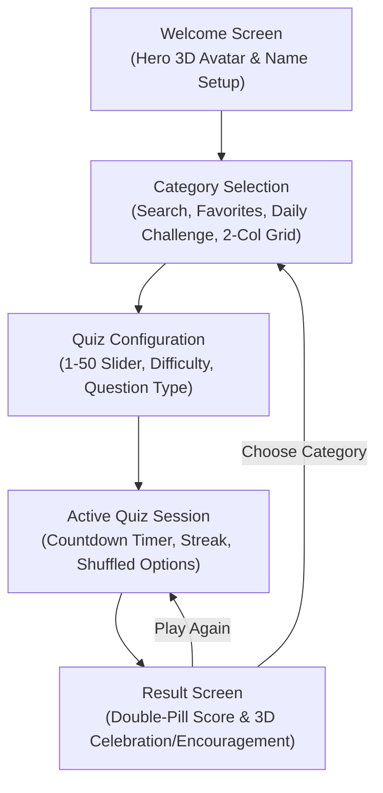

# 🎯 Quizzical — Modern 3D Trivia Quiz Mobile Application

<div align="center">
  
  <br />
  <br />

  [](https://flutter.dev)
  [](https://dart.dev)
  [](#-platforms-supported)
  [](#-architecture--state-management)
  [](https://opentdb.com)
  [](LICENSE)
  [-brightgreen)](#-testing--quality-assurance)

  <p align="center">
    <strong>A production-ready Flutter mobile application featuring a premium 3D Claymorphism design system, 100% unique 3D category artwork for every OpenTDB category, real-time search, favorites, daily challenge, streak tracking, and responsive zero-overflow layouts.</strong>
  </p>
</div>

---

## 📖 Overview

**Quizzical** is a feature-packed mobile trivia quiz application built with Flutter and Dart. Designed with a signature **3D Claymorphism** aesthetic, soft pastel backgrounds, fluid micro-animations, and clean typography, it delivers an engaging educational gaming experience.

The app interfaces directly with the **Open Trivia Database (OpenTDB) REST API**, providing dynamic category discovery, customizable question counts (1–50), multiple difficulty levels, multiple-choice & true/false formats, real-time countdown timers, interactive answer verification, streak tracking, and local persistence via `SharedPreferences`.

---

## ✨ Key Features

### 🎨 1. 100% Unique 3D Category Artworks (24/24 OpenTDB Categories)
- **Strict 1-to-1 Mapping**: Every single category ID (9–32) is mapped to its own unique 3D illustration file in `assets/categories/`. No two categories share the same illustration.
- **Unified 3D Claymorphic Aesthetics**: All illustrations feature soft rounded clay shapes, toy-like objects, warm realistic lighting, subtle shadows, and pastel-tuned backgrounds.
- **Automated Asset Validation**: Runtime and automated test validation (`assertUniqueCategoryAssets()`) guarantees 100% asset uniqueness across the entire catalog.

### 🔍 2. Real-Time Category Search & Filter Tabs
- **Instant Client-Side Filtering**: Quickly search categories by raw or cleaned display names (e.g. searching "science" immediately displays *Science & Nature*, *Computers*, and *Mathematics*).
- **Interactive Tabs**: Filter category views by **All**, **Favorites**, **Recently Played**, and **A–Z** alphabetical sort.

### ❤️ 3. Favorites System
- **Bookmark Categories**: Tap the heart icon (`♥` / `♡`) on any category card to pin it to favorites.
- **Offline Persistence**: Bookmarks are saved locally in `SharedPreferences` and remain accessible across app launches.

### 🕒 4. Recently Played Carousel
- **Instant Replay**: Displays a horizontal carousel of the last 5 categories played at the top of the category screen.
- **Smart Promotion**: Playing a previously completed category promotes it to the front without duplicates.

### 🎯 5. Deterministic Daily Challenge
- **Daily Quiz Mission**: Automatically generates a daily challenge based on today's calendar date without requiring an external backend.
- **Fixed Parameters**: 10 questions, Medium difficulty, multiple choice.
- **Completion Tracking**: Records completion status and score locally (e.g., *"Completed ✓ — Score: 80%"*).

### 🔥 6. Streak & Personal Category Statistics
- **Daily Streak System**: Tracks consecutive days of trivia gameplay with a flame counter (`🔥`) in the AppBar.
- **Per-Category Stats**: Tracks `quizzesPlayed`, `bestScore`, and `lastScore` for each category, displaying a personal star badge (e.g., `★ 90%`) or `🔥 Popular` badge on category cards.

### 📐 7. Zero-Overflow Responsive Layout
- **No RenderFlex Bottom Overflows**: Uses `LayoutBuilder`, `SingleChildScrollView`, `ConstrainedBox`, and dynamic illustration height clamping (`clamp(180, 270)`) across all phone screen sizes.
- **Fixed Card Aspect Ratio**: Category cards maintain a clean `0.84` aspect ratio, ensuring long names (e.g. *Japanese Anime & Manga*, *Cartoon & Animations*) wrap smoothly without clipping.

---

## 🎨 OpenTDB Category 3D Asset Registry

| ID | Category Name | Dedicated Asset File | 3D Visual Subject Elements |
|:---:|:---|:---|:---|
| **9** | General Knowledge | `general_knowledge.png` | 3D smiling blue globe with satellite and origami airplanes |
| **10** | Entertainment: Books | `books.png` | 3D stack of pastel books with an open book |
| **11** | Entertainment: Film | `film.png` | 3D red clapperboard, yellow striped popcorn bucket & film reel |
| **12** | Entertainment: Music | `music.png` | 3D purple over-ear headphones, speaker & floating notes |
| **13** | Entertainment: Musicals & Theatres | `musicals.png` | 3D comedy and tragedy theatrical masks with Broadway spotlight |
| **14** | Entertainment: Television | `television.png` | 3D retro television set with antennae, dials & remote control |
| **15** | Entertainment: Video Games | `video_games.png` | 3D gaming gamepad controller with joystick, 8-bit coin & heart |
| **16** | Entertainment: Board Games | `board_games.png` | 3D winding board game track with colorful meeples & dice |
| **17** | Science & Nature | `science_nature.png` | 3D laboratory microscope, chemical flask & bubbling test tube |
| **18** | Science: Computers | `computers.png` | 3D modern desktop computer with code brackets, keyboard & mouse |
| **19** | Science: Mathematics | `mathematics.png` | 3D pocket calculator, geometry ruler, protractor & math symbols |
| **20** | Mythology | `mythology.png` | 3D Greek pillar, Zeus golden lightning bolt & winged helmet |
| **21** | Sports | `sports.png` | 3D golden championship trophy cup, soccer ball, basketball & tennis ball |
| **22** | Geography | `geography.png` | 3D rolled adventure map, brass navigational compass & pin marker |
| **23** | History | `history.png` | 3D historical parchment scroll with red wax seal & apple |
| **24** | Politics | `politics.png` | 3D voting ballot box with checkmark ballot, gavel & capitol dome |
| **25** | Art | `art.png` | 3D ceramic mug with star holding colorful crayons & paint supplies |
| **26** | Celebrities | `celebrities.png` | 3D Hollywood star with sunglasses on red carpet & microphone |
| **27** | Animals | `animals.png` | 3D smiling cartoon lion cub face with paw prints & foliage |
| **28** | Vehicles | `vehicles.png` | 3D blue toy car with round headlights |
| **29** | Entertainment: Comics | `comics.png` | 3D superhero comic book with 'POW' action speech bubble |
| **30** | Science: Gadgets | `gadgets.png` | 3D modern smartwatch and smart tech peripheral accessories |
| **31** | Entertainment: Japanese Anime & Manga | `japanese_anime_manga.png` | 3D manga book & stylized sakura anime action aesthetic |
| **32** | Entertainment: Cartoon & Animations | `cartoon_animations.png` | 3D animation desk, cute animated character & pencils |
| **—** | Default Fallback | `default.png` | 3D Quizzical gold question mark brand mascot |

---

## 📱 Application Flow & Screens



---

## 📂 Project Structure

```
quizzical/
├── assets/
│   ├── branding/              # Brand logos, app icon marks
│   │   ├── quizzical_logo.png
│   │   ├── quizzical_icon.png
│   │   └── quizzical_logo_mark.png
│   ├── categories/            # 24 individual unique 3D category assets + default
│   │   ├── general_knowledge.png
│   │   ├── books.png
│   │   ├── film.png
│   │   ├── music.png
│   │   ├── musicals.png
│   │   ├── television.png
│   │   ├── video_games.png
│   │   ├── board_games.png
│   │   ├── science_nature.png
│   │   ├── computers.png
│   │   ├── mathematics.png
│   │   ├── mythology.png
│   │   ├── sports.png
│   │   ├── geography.png
│   │   ├── history.png
│   │   ├── politics.png
│   │   ├── art.png
│   │   ├── celebrities.png
│   │   ├── animals.png
│   │   ├── vehicles.png
│   │   ├── comics.png
│   │   ├── gadgets.png
│   │   ├── japanese_anime_manga.png
│   │   ├── cartoon_animations.png
│   │   └── default.png
│   ├── quiz/                  # Welcome hero and configuration 3D art
│   │   ├── welcome_hero.png
│   │   └── configuration.png
│   └── result/                # Celebration and encouragement 3D illustrations
│       ├── celebration.png
│       └── keep_trying.png
├── lib/
│   ├── main.dart              # Application entry point & Provider setup
│   ├── models/                # Data structures (Category, Question)
│   │   ├── category.dart
│   │   └── question.dart
│   ├── providers/             # State management with local persistence
│   │   └── quiz_provider.dart
│   ├── screens/               # Screen widgets
│   │   ├── home_screen.dart
│   │   ├── categories_screen.dart
│   │   ├── quiz_config_screen.dart
│   │   ├── quiz_screen.dart
│   │   └── result_screen.dart
│   ├── services/              # Networking layer (OpenTDB API)
│   │   └── trivia_service.dart
│   ├── utils/                 # Design tokens, HTML decoder & CategoryHelper
│   │   ├── app_colors.dart
│   │   ├── category_helper.dart
│   │   └── html_decoder.dart
│   └── widgets/               # Reusable atomic UI components
│       ├── answer_option.dart
│       ├── category_card.dart
│       ├── category_illustrations.dart
│       ├── illustrations.dart
│       └── primary_button.dart
├── test/
│   ├── quiz_test.dart         # Unit tests (models, decoder, provider, asset uniqueness)
│   └── widget_test.dart       # Widget UI smoke tests
├── pubspec.yaml               # Dependencies and asset declarations
└── README.md
```

---

## 🧪 Testing & Quality Assurance

The codebase includes comprehensive unit tests and widget tests covering HTML decoding, JSON model serialization, asset uniqueness validation, provider logic, and UI rendering:

```bash
flutter test
```

### Test Suite Summary (10/10 Passing):
- ✔️ Named HTML entity decoding (`&quot;`, `&amp;`, `&#039;`, etc.)
- ✔️ Numeric decimal and hex HTML entity parsing
- ✔️ `Category.fromJson` serialization
- ✔️ `Question.fromJson` answer combination and shuffling
- ✔️ `CategoryStats` JSON serialization & deserialization
- ✔️ `CategoryHelper.assertUniqueCategoryAssets()` verifies 100% unique 3D assets
- ✔️ All 24 OpenTDB category IDs (9–32) map to distinct assets
- ✔️ `QuizProvider` configuration defaults and lifecycle
- ✔️ `QuizProvider` favorites toggling logic
- ✔️ `QuizzicalApp` widget tree smoke test

Code analysis:
```bash
flutter analyze
# Result: No issues found! (ran in 7.6s)
```

---

## 🚀 Getting Started

### Prerequisites
- [Flutter SDK](https://docs.flutter.dev/get-started/install) (`^3.13.0` or higher)
- [Dart SDK](https://dart.dev/get-dart) (`^3.0.0`)
- Android Studio / VS Code with Flutter extension
- Android SDK (API 34+ recommended)

### Installation
1. **Clone the repository**:
   ```bash
   git clone https://github.com/SOURAVcse9/quizzical-flutter-app.git
   cd quizzical-flutter-app
   ```

2. **Install Flutter packages**:
   ```bash
   flutter pub get
   ```

3. **Run the app**:
   ```bash
   flutter run
   ```

4. **Build Release APK**:
   ```bash
   flutter build apk --release
   ```
   *The generated APK is available at `build/app/outputs/flutter-apk/app-release.apk` (65.6 MB).*

---

## 👨‍💻 Author

**Sourav Debnath**
- **GitHub**: [@SOURAVcse9](https://github.com/SOURAVcse9)
- **Email**: [sourav.cse9.bu@gmail.com](mailto:sourav.cse9.bu@gmail.com)
- **Institution**: Department of Computer Science & Engineering, University of Barishal

---

## 📄 License

This project is licensed under the [MIT License](LICENSE).
